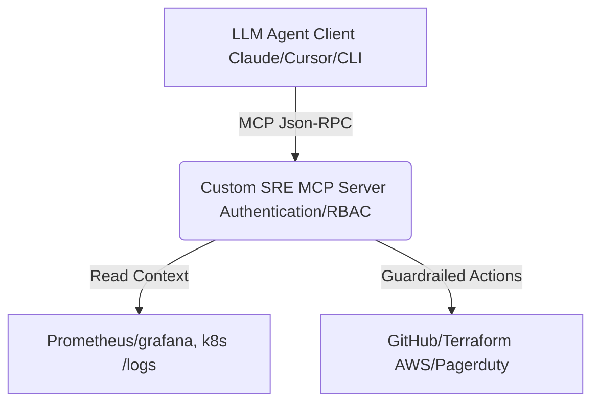

# Incident_triage_MCP
Goal is to build a custom MCP server that exposes high-value operational context and safe, policy-enforced actions to AI Clients

```mermaid
flowchart TD
    A[LLM Agent Client Claude/Cursor/CLI] -->|MCP Json-RPC| B(Custom SRE MCP Server Authentication/RBAC)
    B -- Read Context --> C[Prometheus/grafana, k8s /logs]
    B -- Guardrailed Actions --> D[GitHub/Terraform AWS/Pagerduty]
```

